# Отчет по лабораторной работе №2

**Исполнитель:** Мещенко Валерия, гр. 10  
**Репозиторий:** `lab2-task1-gr10-meschenko`

---

## Задание 1. Консольные приложения

### 1. Руководство по созданию проекта в Github и Repl.it
Познакомилась с руководством по созданию репозитория и активации аккаунта для сервиса Repl.it. 

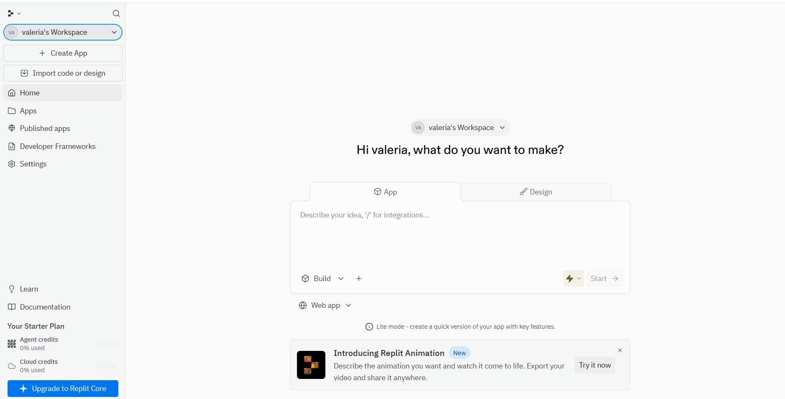 

### 2. Создание репозитория из шаблона
Создала репозиторий на основе шаблона `maryiad/project-forlab3-tp`. Репозиторий назван согласно установленному формату: `lab2-task1-gr10-meschenko`.
* **Статус подключения:** Active.

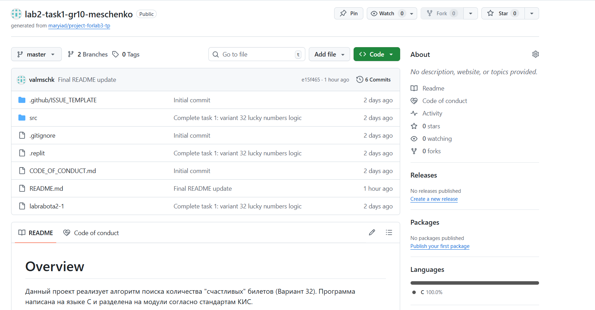

### 3. Импорт проекта в Repl.it

Проект был успешно импортирован в среду Repl.it. Выполнена авторизация через GitHub.

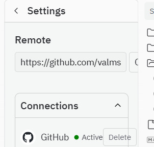

### 4. Работа в ветке development
Согласно требованиям к ведению проектов, была создана ветка `development`. Переключилась в неё для выполнения всех задач, чтобы сохранить ветку `master` в стабильном состоянии. Все последующие коммиты выполнялись в этой ветке.

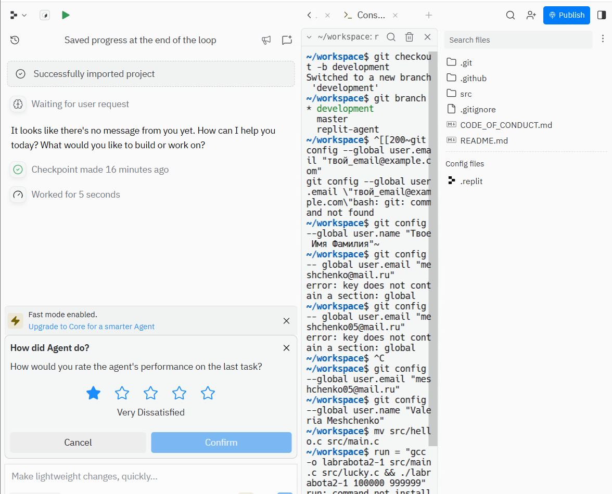
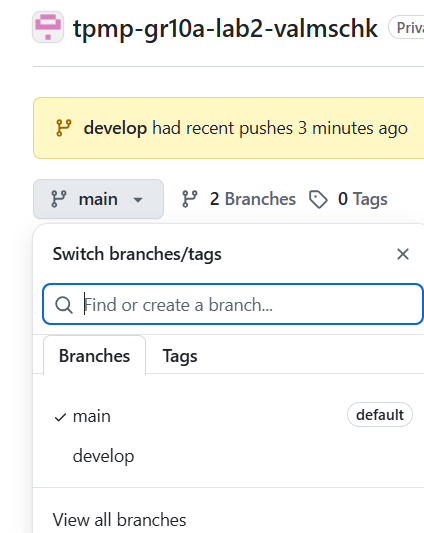

### 5. Отредактировала файл README.md
Заполнила описание проекта и добавила свои данные.

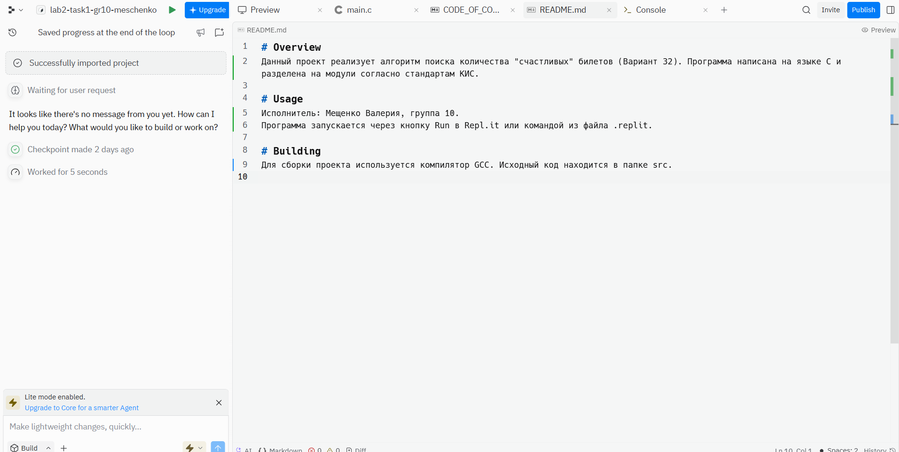
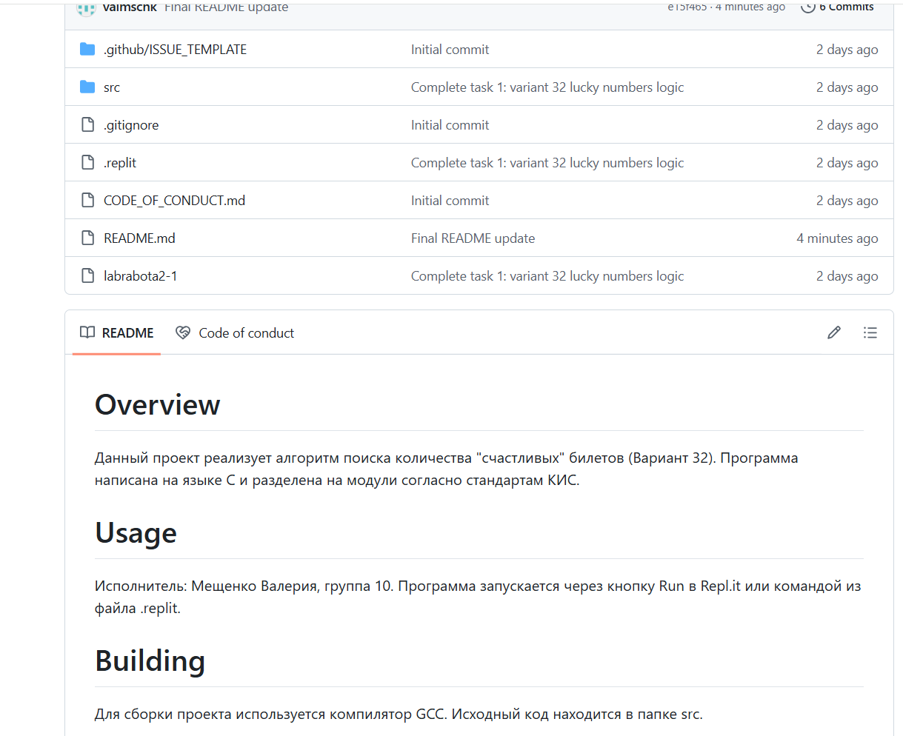

### 6. Переименование файла
Выполнила переименование основного файла исходного кода из `hello.c` в `main.c`. Это привело структуру проекта к стандартному виду, где `main.c` является точкой входа в приложение. 

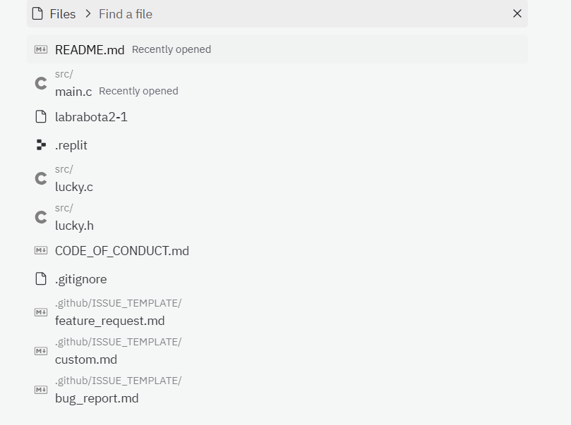

### 7. Настройка автоматизации сборки в .replit
Отредактировала конфигурационный файл `.replit` для управления процессом компиляции. Изменила команду `run` так, чтобы компилятор `gcc` собирал все модули проекта в один исполняемый файл.

* **Было:** `run = "gcc -o hello src/hello.c && ./hello"`
* **Стало:** `run = "gcc -o labrabota2-1 src/main.c src/lucky.c && ./labrabota2-1 100000 999999"`

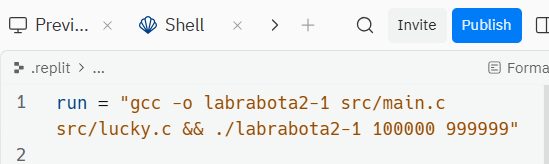

### 8. Настройка исключений контроля версий (.gitignore)
Внесла изменения в файл `.gitignore`. Добавила в список исключений имя бинарного файла `labrabota2-1`.

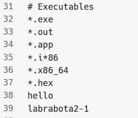

### 9. Синхронизация промежуточных изменений
**Описание:** Выполнила фиксацию (commit) всех базовых настроек проекта, включая конфигурационные файлы `.replit`, `.gitignore` и `README.md`. Это обеспечило стабильную отправную точку перед реализацией основного алгоритма.

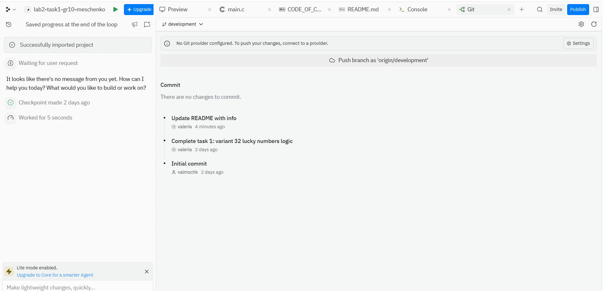

### 10. Применение стандартов кодирования
**Описание:** При написании исходного кода программных модулей `main.c` и `lucky.c` строго соблюдались общепринятые стандарты (Google C Style / LLVM). 

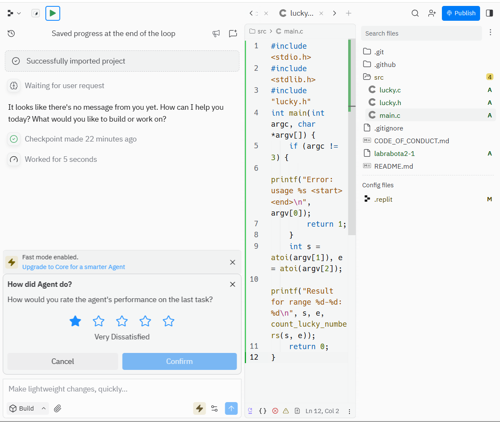
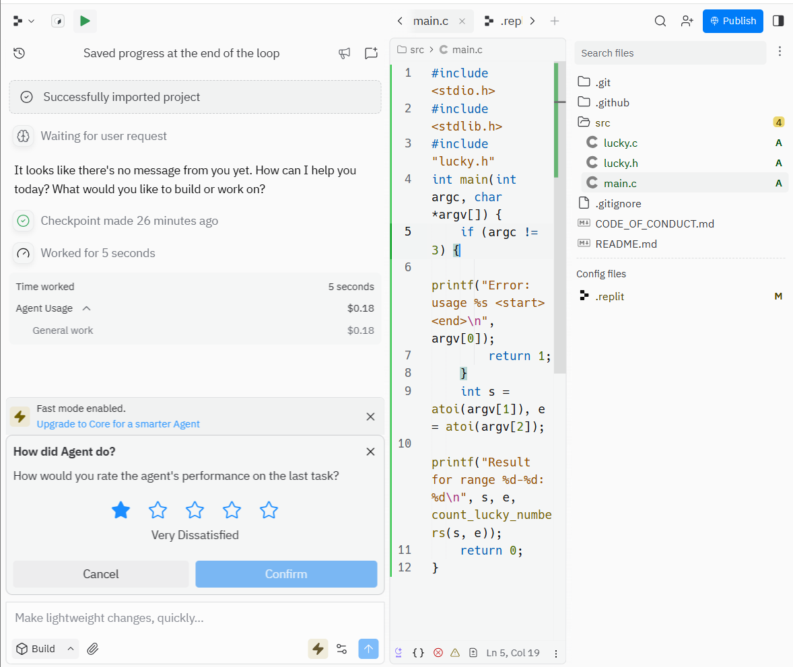 

### 11. Пошаговая фиксация изменений (Commit history)
**Описание:** Разработка велась итерационно. Каждое значимое изменение фиксировалось отдельным коммитом.
* **Результат:** В истории репозитория отображается последовательность разработки.

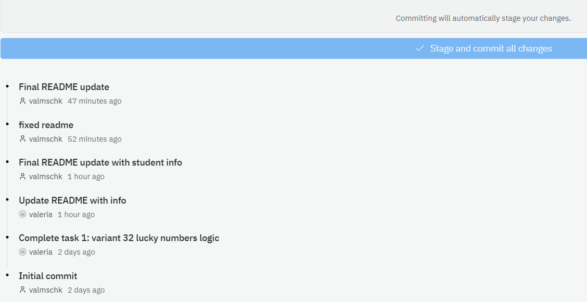

### 12. Работа с аргументами командной строки
**Описание:** В соответствии с заданием, программа не использует интерактивный ввод. Все исходные данные передаются через аргументы `argc` и `argv`.
* **Реализация:** Программа считывает границы диапазона из командной строки.

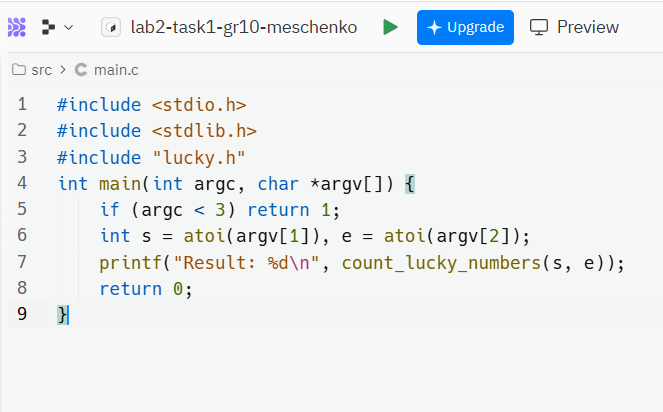

### 13. Тестирование (контрольный расчет)
**Описание:** Проведен контрольный запуск программы для проверки точности алгоритма. В качестве тестовых данных использован полный диапазон шестизначных чисел.
* **Результат:** Программа успешно обработала диапазон `100000`–`999999` и вывела корректное количество "счастливых" билетов.

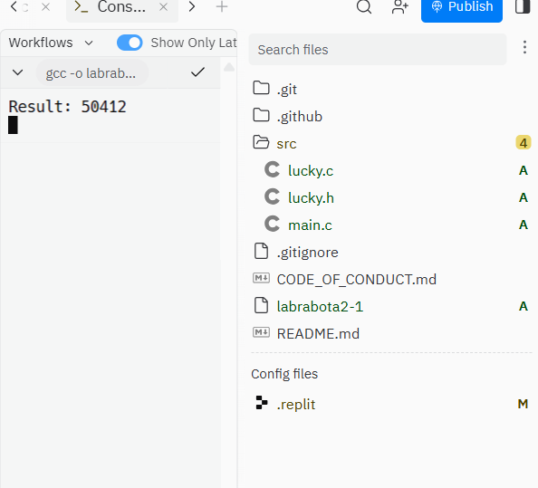

### 14. Финальная публикация изменений
**Описание:** После успешного завершения всех этапов разработки была выполнена итоговая публикация кода через команду `git push origin development`.

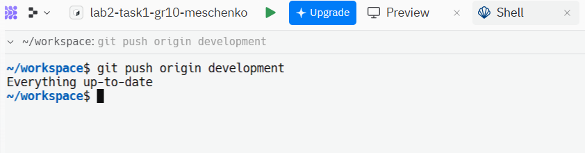

### 15. Слияние веток через Pull Request
**Описание:** Для завершения работы над заданием был создан и подтвержден запрос на слияние (Pull Request) изменений из ветки `development` в основную ветку `master`.

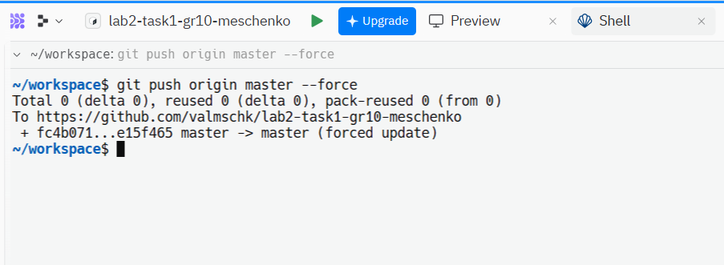


---

## Задание 2. ИЗУЧАЕМ КУРС GitHub Actions: Hello World

*В ходе выполнения курса "Hello GitHub Actions" была реализована система автоматического приветствия авторов новых Pull Request.*

### 1. Инициализация проекта и настройка окружения
Создала репозиторий на базе шаблона от GitHub Skills и отдельную ветку `welcome-workflow` для работы.

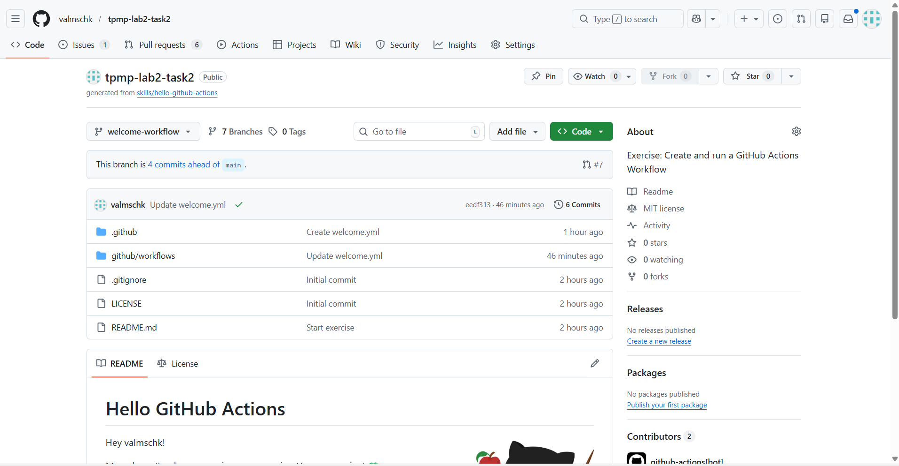

### 2. Создание структуры каталогов и работа над ошибками
* **Проблема:** Изначально папка была создана без точки `github/workflows/`, из-за чего автоматизация не запускалась.
* **Решение:** Переименовала папку в `.github/workflows/`. Это позволило серверу GitHub распознать сценарий.


### 3. Тестирование и проверка автоматизации
Создала тестовый запрос на слияние (Pull Request #7) для проверки работы триггера.

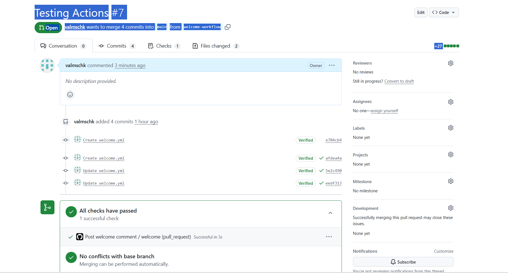

### 4. Финализация (Merge)
После успешного теста объединила изменения с основной веткой нажатием кнопки "Merge pull request".

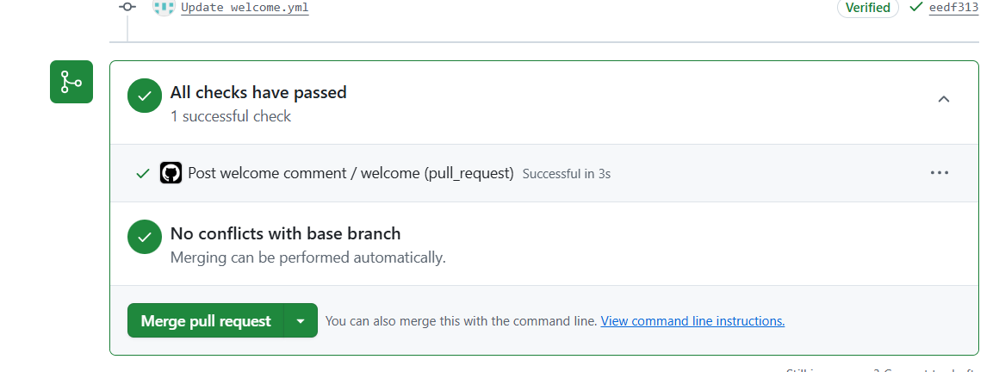

---

## Задание 3. ИСПОЛЬЗУЕМ СТРУКТУРЫ ДЛЯ ПРЕДСТАВЛЕНИЯ ДАННЫХ

### 1. Создание репозитория
Репозиторий был создан в личном профиле на GitHub со следующими параметрами:
* **Название:** `tpmp-lab2-task3`
* **Публичность:** Public
* **Инициализация:** Создан пустым для локальной настройки.

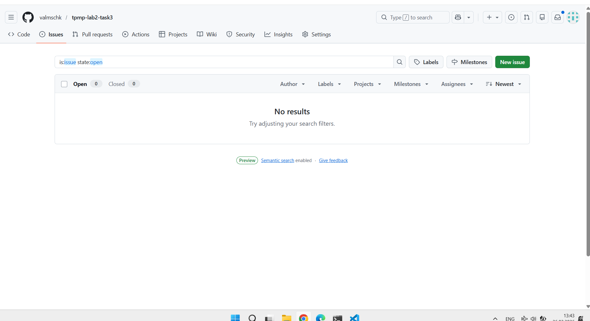

### 2. Клонирование и структура проекта
Создана структура проекта: папка `src` для исходного кода и `Makefile` в корне.

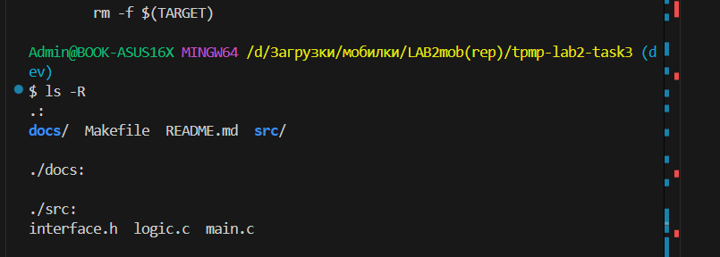

### 3. Оформление файла README.md
Файл `README.md` наполнен структурированной информацией: Overview, Author (Мещенко В., группа 10), Usage и Additional Notes со ссылками на предыдущие задания.

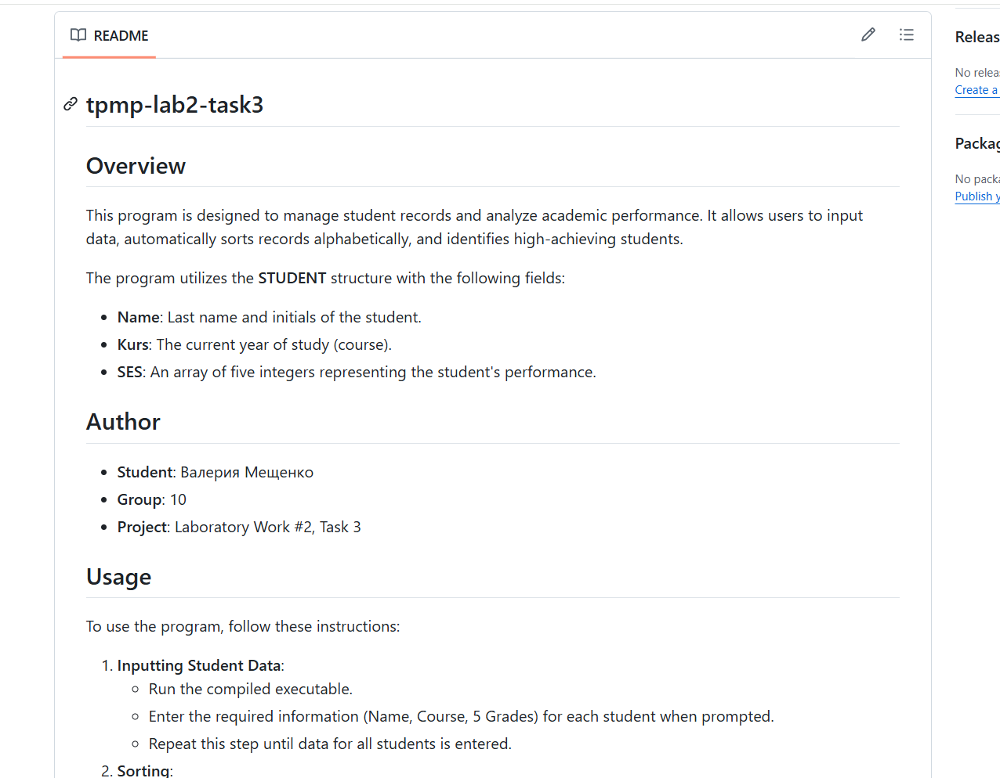
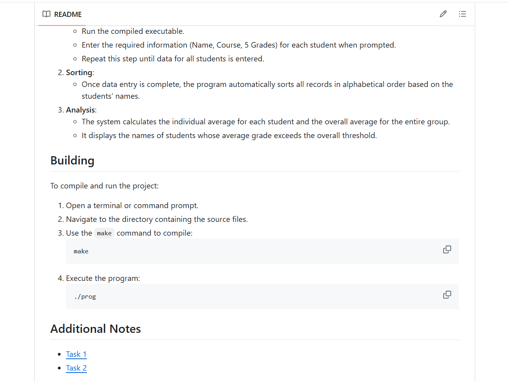

### 4. Работа с ветками (Git Flow)
Работа велась с соблюдением правил ветвления. Ветка `main` для стабильных версий, `dev` — для разработки.
1. Создание и переключение на `dev`: `git checkout -b dev`.
2. Пуш ветки на сервер: `git push origin dev`.

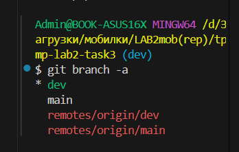
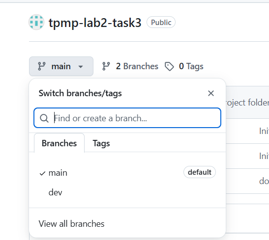
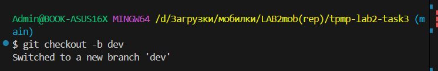

### 5. Создание файла автоматизированной сборки Makefile
Разработан `Makefile` с целями `all` и `clean`, а также флагами компиляции `-Wall`.

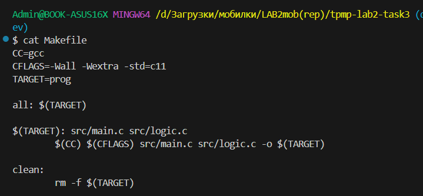

### 6. Реализация программы по модели КИС
Программа разделена на три логических уровня:
1. **Интерфейс (`src/interface.h`)**: Определение структуры `STUDENT` и прототипы.
2. **Сервер (`src/logic.c`)**: Логика сортировки и анализа.
3. **Клиент (`src/main.c`)**: Ввод/вывод данных.

Весь код был написан непосредственно в консольном редакторе `nano`.

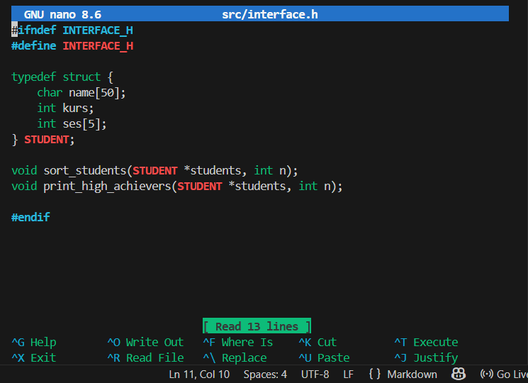
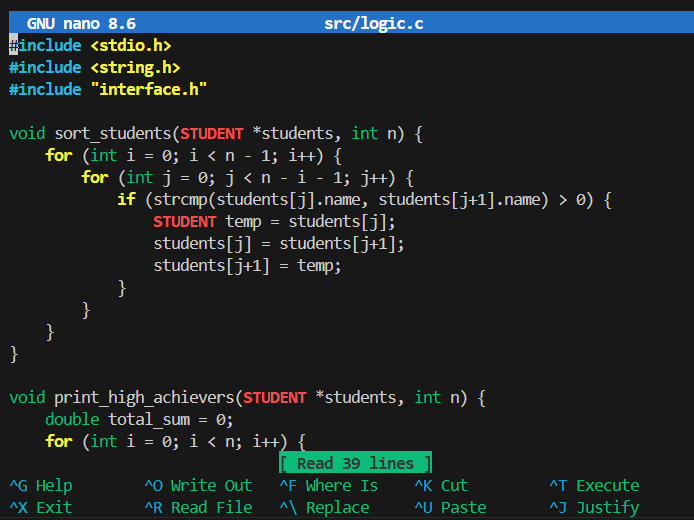
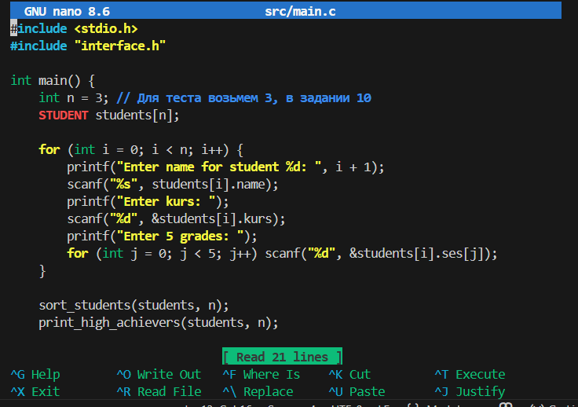

### 7. Стандарты оформления и сборка
Код написан в соответствии со стандартами языка C. Проверка сборки осуществлялась утилитой `make`.

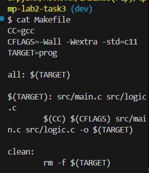

### 8. Сборка проекта с помощью make и Github Actions
Настроена интеграция локального `Makefile` с GitHub Actions для автоматизации компиляции.


### 9. Создание конфигурационного файла ci.yml
Создана папка `.github/workflows` и файл `ci.yml` с инструкциями сборки (среда `ubuntu-latest`, шаги checkout, make, run).


### 10. Проверка сборки на стороне GitHub
После `git push` была успешно инициирована и пройдена автоматическая сборка.


### 11. Интеграция с главным репозиторием
Основной репозиторий лабораторной работы `tpmp-gr10a-lab2-valmschk` был успешно клонирован в локальную рабочую директорию.

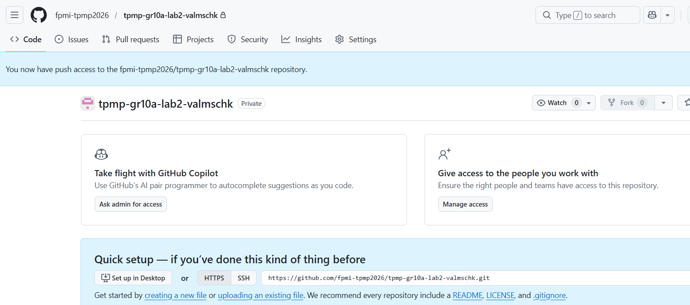

### 12. Обновление общего README.md
В корневом каталоге главного репозитория оформлен файл `README.md` с описанием интеграции подмодуля Task 3.

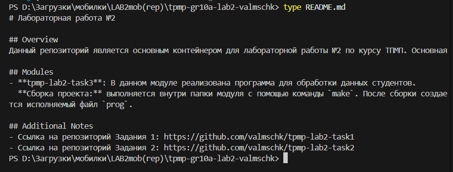
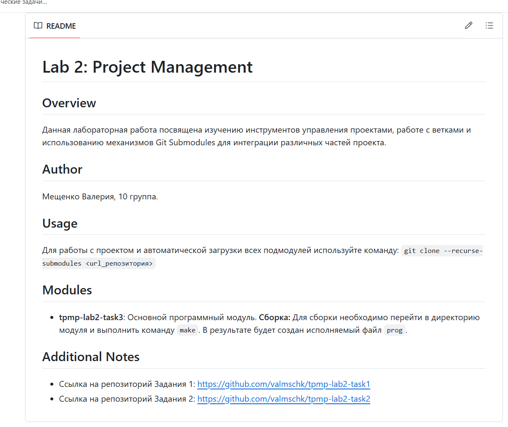

### 13. Работа с ветками (Git Flow) в главном проекте
Инициализирована ветка разработки `develop`.

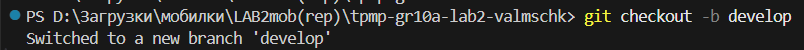


### 14. Добавление подмодуля (Submodule)
Репозиторий `tpmp-lab2-task3` добавлен как модуль (submodule) в главный проект.

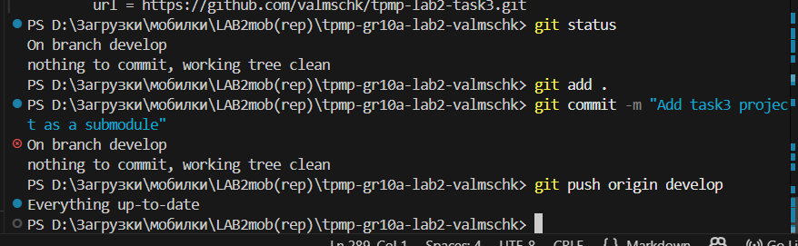

### 15. Проверка конфигурации .gitmodules
Автоматически создался файл `.gitmodules`. Проверено его содержимое (путь и URL).

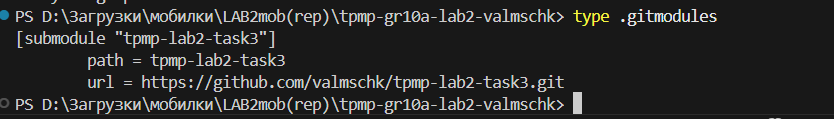

### 16. Фиксация и публикация изменений
Изменения (подмодуль и файл конфигурации) зафиксированы и отправлены в удаленный репозиторий.

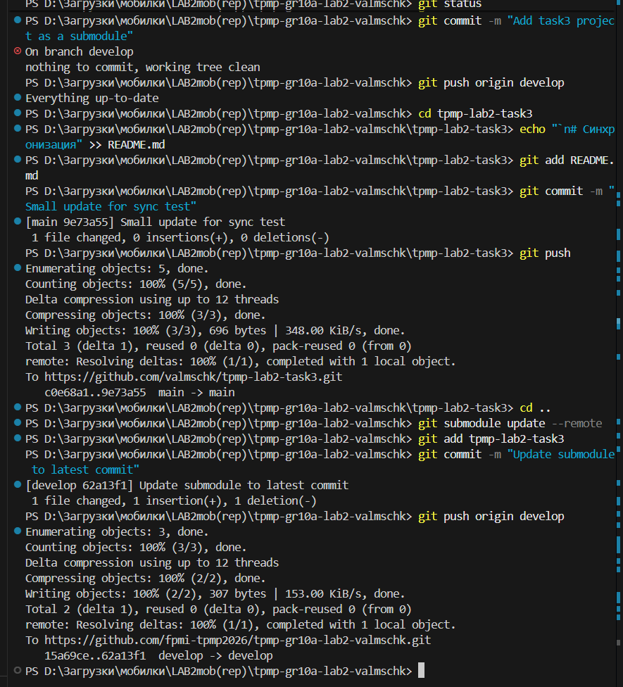

---

## Задание 4. Этап 1. Подготовка репозитория

### 1. Создание репозитория на GitHub
Был создан публичный репозиторий `tpmp-lab2-task4` без инициализации стандартными файлами, чтобы настроить структуру локально.

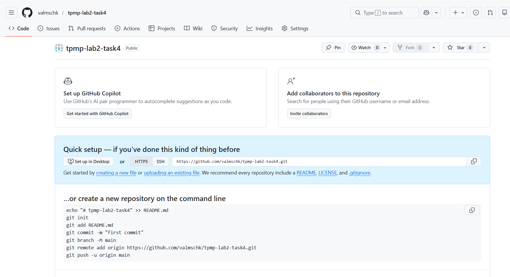

### 2. Клонирование и структура
Выполнено клонирование по SSH. Созданы папки `src`, `docs` и файл `Makefile` согласно модели КИС.


### 3. Создание и оформление файла README.md
В корне `tpmp-lab2-task4` создан `README.md` с разделами Overview, Author, Usage, Additional Notes.

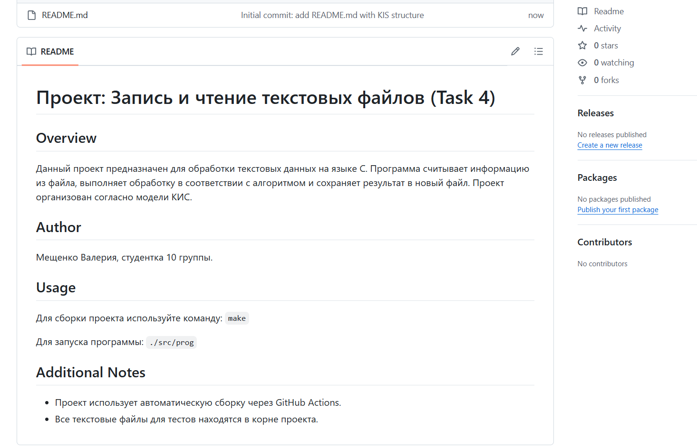

### 4. Работа с ветками проекта
Создана и опубликована ветка `develop`. Дальнейшая разработка производилась в ней.

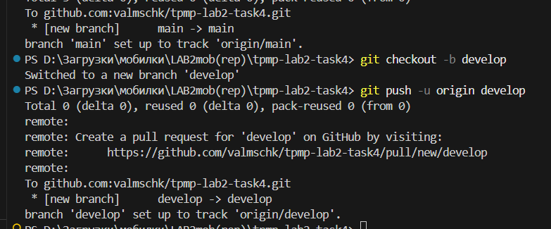

### 5. Организация структуры проекта (КИС)
Окончательно сформирована иерархия каталогов. 

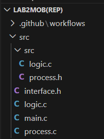

### 6. Реализация программы обработки файлов
В редакторе `nano` разработан код для перевода текста из файла в верхний регистр:
* `src/process.h` — прототипы.
* `src/process.c` — логика обработки.
* `src/main.c` — файловые потоки.
* `Makefile` — сборка.

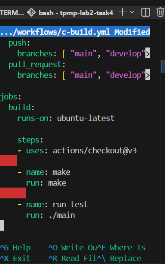
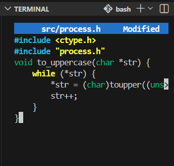

### 7. Сборка через GitHub Actions
Настроена система CI для автоматической сборки проекта при коммитах.


### 8. Проведение тестов (Контрольный расчет)
Алгоритм успешно верифицирован, результаты задокументированы в `docs/tests.md`.

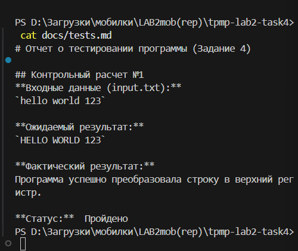

---

## Задание 4. Этап 2. Интеграция подмодуля

### 1. Добавление подмодуля Task 4
Проект Task 4 успешно привязан к главному репозиторию лабораторной работы.


### 2. Добавление инструкции по сборке
В главный файл `README.md` добавлен раздел по сборке нового модуля.


### 3. Фиксация изменений в репозитории
Обновленный `.gitmodules` и ссылки на коммиты зафиксированы и отправлены на сервер.

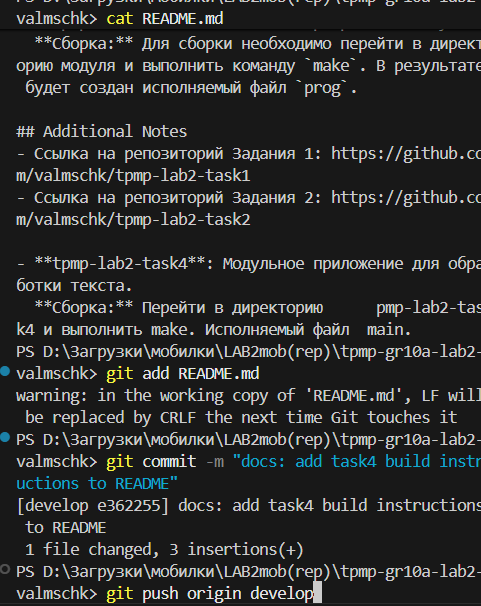

---

## Контрольные вопросы по Лабораторной работе №2

### 1. Приведите примеры облачных IDE
AWS Cloud9, CodeTasty, Gitpod, Repl.it, JSFiddle, Arduino Web Editor, Codeanywhere.

### 2. Опишите процесс подключения репозитория в repl.it
1. Авторизация на сайте через аккаунт GitHub.
2. Нажатие кнопки **«Create Repl»** и выбор вкладки **«Import from GitHub»**.
3. Вставка ссылки на нужный репозиторий.
4. Выбор языка программирования и конфигурация команды запуска.

### 3. Что такое «сборка»?
**Сборка** — это процесс преобразования исходного кода и ресурсов в готовый программный продукт (исполняемый файл, библиотеку или пакет).

### 4. Какие утилиты могут использоваться для сборки?
Компиляторы (**gcc**, **clang**), системы автоматизации (**make**, **CMake**, **Gradle**, **Ninja**, **Ant**).

### 5. Для чего служит Makefile?
**Makefile** — это конфигурационный файл для утилиты `make`, содержащий инструкции (правила) о том, как именно нужно компилировать и связывать файлы проекта. Он автоматизирует процесс сборки, экономя время за счет пересборки только измененных файлов.

### 6. Что такое цель в Makefile? Приведите пример.
**Цель (target)** — это результат, который должен быть получен (имя файла или название действия).
* *Пример:* `main.o` (цель-файл) или `all` (абстрактная цель).

### 7. Что такое связка в Makefile? Приведите пример.
**Связка** — это законченный блок, состоящий из цели, её зависимостей и команд (правил) для выполнения.
* *Пример:*
    ```makefile
    main: main.o
        gcc main.o -o main
    ```

### 8. Что такое зависимость в Makefile? Приведите пример.
**Зависимости (prerequisites)** — это файлы или другие цели, которые должны существовать до того, как начнется сборка текущей цели.
* *Пример:* в строке `main: main.c process.h` файлы `main.c` и `process.h` являются зависимостями для цели `main`.

### 9. Что такое правило в Makefile? Приведите пример.
**Правила (recipes)** — это команды оболочки, которые выполняют сборку. Они обязательно должны начинаться с символа **Tab**.
* *Пример:* `gcc -c main.c -o main.o`

### 10. Что такое макроопределение в Makefile? Приведите пример.
**Макроопределения (переменные)** — это идентификаторы для хранения строк текста (имена компиляторов, флаги, списки файлов).
* *Пример:* `CC = gcc`. Обращение к нему в коде: `$(CC)`.

### 11. Какая связка используется для очистки проекта?
Связка с целью **clean**. Она удаляет временные объектные файлы и исполняемые файлы.
* *Пример:*
    ```makefile
    clean:
        rm -rf *.o main
    ```

### 12. В чем заключается модель КИС для проектов на языке C?
Модель **КИС (Клиент-Интерфейс-Сервер)** — это архитектурный подход к разделению кода:
* **Клиент:** Главный файл (`main.c`), управляющий логикой.
* **Интерфейс:** Заголовочные файлы (`.h`), описывающие прототипы функций.
* **Сервер:** Файлы реализации (`.c`), содержащие логику функций.

### 13. Что такое стандарты кодирования и почему рекомендуется им следовать?
Это набор правил оформления кода (отступы, именование). Им следуют для повышения читаемости кода, уменьшения ошибок и облегчения совместной работы.

### 14. Какой должна быть структура проекта согласно модели КИС и правилам сборки?
* `/src` — исходные коды (`.c`).
* `/include` — заголовочные файлы (`.h`).
* `/docs` — документация и тесты.
* `Makefile` и `README.md` — в корне проекта.

### 15. Что такое GitHub Actions и для каких задач применяется данный функционал?
Это система непрерывной интеграции и доставки (CI/CD). Применяется для автоматического тестирования, сборки и деплоя приложений прямо в репозитории.

### 16. Что такое workflow в GitHub Actions? Приведите пример.
**Workflow** — это автоматизированный процесс, описанный в `.yml` файле.
* *Пример:* Сценарий `c-build.yml` для автоматической компиляции проекта.

### 17. Что такое event в GitHub Actions? Приведите пример.
**Event** — это событие, вызывающее запуск процесса.
* *Пример:* `push` (отправка кода), `pull_request`.

### 18. Что такое job в GitHub Actions? Приведите пример.
**Job** — это группа шагов, выполняемая на одном виртуальном сервере.
* *Пример:* Задание `build` или `test_suite`.

### 19. Что такое step в GitHub Actions? Приведите пример.
**Step** — это конкретная задача внутри Job (команда или действие).
* *Пример:* `run: make` или `uses: actions/checkout@v3`.

### 20. Что такое action в GitHub Actions? Приведите пример.
**Action** — это готовый многократно используемый блок кода для типовых задач.
* *Пример:* `actions/checkout@v3` (клонирование кода в виртуальную среду).