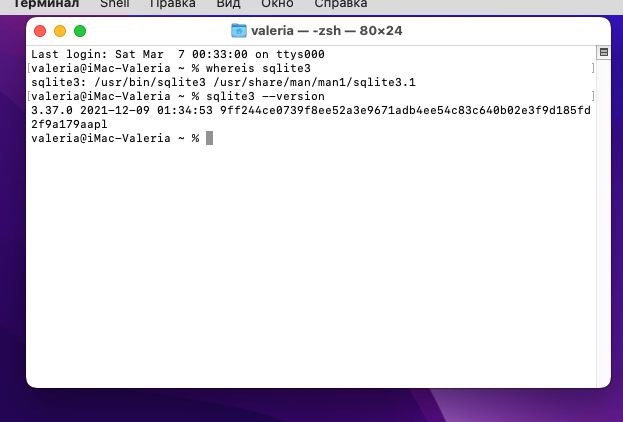

# Отчёт по лабораторной работе №3

## Задание 1. Установка и проверка SQLite в macOS

В ОС macOS SQLite является встроенным компонентом. Для проверки были выполнены следующие шаги:

1. **Проверка местоположения утилиты:**
   Команда `whereis sqlite3` показала, что исполняемый файл находится в `/usr/bin/sqlite3`.
2. **Проверка версии:**
   Команда `sqlite3 --version` подтвердила наличие версии **3.37.0** (согласно скриншоту терминала).

## 1. Создание таблицы (CREATE)
Первым шагом в консоли SQLite создается структура таблицы. Используется язык определения данных (DDL).

Описание: Создана таблица с уникальным идентификатором, текстовыми полями для бренда и модели, а также числовым полем для цены.

## 2. Вставка данных (INSERT)
Таблица была наполнена записями (6 студентов) для последующей проверки фильтрации.

## 3. Выборка данных (SELECT, ORDER BY, LIMIT)
Продемонстрированы возможности языка DQL по извлечению данных.

## 4. Выборка с фильтрацией (WHERE, LIKE)
Использование условий для поиска конкретных записей.

## 5. Переименование таблицы (ALTER)
Изменение схемы базы данных без удаления объектов.

## 6. Обновление данных (UPDATE)
Изменение существующих записей в таблице.

## 7. Удаление строк (DELETE)
Удаление строк по разным критериям.

## 8. Экспорт базы данных (.sql, .csv)
Использование системных команд консоли для сохранения данных во внешние файлы.

## 9. Удаление таблицы (DROP)
Полное удаление объекта из базы данных.

# Отчет по выполнению упражнений 2.3 и 2.4
## Работа с базой данных «Кинолента» в СУБД SQLite

---

### 1. Создание таблицы (CREATE)
Для начала работы была создана база данных `my_database.db`. В ней была спроектирована таблица `films` со следующей структурой:
* `id` — INTEGER PRIMARY KEY (уникальный идентификатор);
* `title` — название фильма;
* `director_last_name`, `director_first_name` — данные режиссера;
* `release_year` — год выхода;
* `country` — страна;
* `cost`, `revenue`, `profit` — финансовые показатели (стоимость, доход, прибыль);
* `ticket_price` — цена билета;
* `genre` — жанр.

**Скриншот выполнения:** 

---

### 2. Вставка данных (INSERT)
В созданную таблицу были добавлены сведения о **10 кинолентах** (от "Film A" до "Film J"). Каждая запись содержит уникальный набор данных о режиссерах, странах производства и финансовых результатах.

**Скриншот выполнения:** 

---

### 3. Выборка данных (SELECT)
Были отработаны различные навыки извлечения информации из БД:
* **Сортировка:** Вывод всех записей, упорядоченных по `id`.
* **Ограничение:** Использование инструкции `LIMIT 5` для получения первых пяти строк.
* **Точная фильтрация:** Выборка записи с конкретным `id = 5`.
* **Поиск по маске:** Использование оператора `LIKE 'F%'` для поиска всех фильмов, название которых начинается на букву «F».

**Скриншот выполнения:** 

---

### 4. Обновление и удаление данных (UPDATE, DELETE, ALTER)
Продемонстрированы навыки модификации структуры и содержимого таблицы:
* **Переименование:** Таблица `films` была успешно переименована в `movies` командой `ALTER TABLE`.
* **Обновление:** Изменен показатель дохода (`revenue`) для фильма с `id = 5`.
* **Удаление:** Удалены конкретные записи по идентификатору (`id = 10`) и по названию объекта (`title = 'Film A'`).

**Скриншот выполнения:** 

---

### 5. Экспорт в CSV и удаление таблицы (DROP)
Для переноса данных были выполнены сервисные команды SQLite:
1. Включено отображение заголовков (`.headers on`).
2. Установлен режим CSV (`.mode csv`).
3. Выполнен экспорт данных в файл `data.csv`.
4. В завершение текущего этапа таблица была полностью удалена командой `DROP TABLE`.

**Скриншот выполнения:** 

---

### 6. Фильтрация по доходу и изменение структуры
Выполнен запрос на выборку фильмов, доход которых составляет **менее 100 000 BYN**. Также структура таблицы была расширена путем добавления столбца `cinematheatre_id` (тип `INTEGER`) для будущей связи с таблицей кинотеатров.

**Скриншот выполнения:** 

---

### 7. Агрегатные функции и объединение таблиц (JOIN)
Заключительный этап работы включал сложные запросы и работу с несколькими таблицами:
* **Новая таблица:** Создана таблица `cinema_theatres` (id, название, город).
* **Специфическая выборка:** Вывод только определенных столбцов (id, название, цена билета).
* **Агрегация:** * Подсчитано общее количество фильмов с ценой билета **>= 3 BYN** через `COUNT`.
    * Определены максимальная и минимальная прибыль по всей таблице через `MAX` и `MIN`.
* **Связывание таблиц:** Использование `INNER JOIN` для получения полного отчета, объединяющего данные о фильмах и кинотеатрах, в которых они демонстрировались.

**Скриншот выполнения:** 

---

## Заключение
В ходе выполнения работы были полностью освоены базовые операции SQL: создание, заполнение, фильтрация, обновление, удаление и экспорт данных. База данных «Кинолента» была успешно спроектирована и проанализирована с помощью агрегатных функций и механизмов связывания таблиц.

## Задание 2. Создание и управление БД «Кинолента»

### Упражнение 2.3. Создание и заполнение таблицы
Была создана база данных `Cinema.db` и таблица `movies`. В таблицу внесены сведения о 13 кинолентах (более требуемых 10) разных режиссеров.

**Поля таблицы:** `id`, `title`, `director_last_name`, `director_first_name`, `release_year`, `country`, `cost`, `revenue`, `profit`, `ticket_price`, `genre`.

  
*Рисунок 1 — SQL-запрос INSERT для наполнения базы.*

  
*Рисунок 2 — Просмотр добавленных записей в режиме Browse Data.*

### Упражнение 2.4. Выполнение целевых запросов

**1. Фильтрация: доход < 100 000 BYN** Запрос: `SELECT title, director_last_name, revenue FROM movies WHERE revenue < 100000;`  

**2. Добавление столбца через ALTER и создание таблицы cinematheatres** Создана таблица `cinematheatres` (id, ct_name, ct_city) и добавлены города: Минск и Гродно. В основную таблицу добавлен внешний ключ `cinematheatre_id`.  

**3. Идентификатор, название и цена билета** Выведен краткий список всех кинолент.  

**4. Агрегатные функции (COUNT, SUM, MAX, MIN)** * **Количество фильмов (цена >= 3 BYN):** Найдено 13 фильмов.  
    
* **Суммарный доход (г. Минск):** Общий доход составил 1 651 500.0.  
    
* **Прибыль (MAX/MIN):** Максимальная — 668 000.0, Минимальная — -1000.0.  
    

**5. Объединение таблиц (INNER JOIN)** Выведены полные сведения о фильмах и кинотеатрах, где они проходили.  

---

## Задание 3. Учет расходов

### Упражнение 3.2. Выполнение запросов по варианту

**1. Запрос к трем таблицам (Goods, Goods_Spendings, Spendings)** Запрос возвращает наименование, количество и дату для товара «Пиво». Использовано последовательное соединение таблиц через ID.  

**2. Покупки на сумму более 1200 руб.** Запрос: `SELECT * FROM Spendings WHERE Amount > 1200;`  

---

## Вывод
В ходе работы были практически отработаны навыки проектирования реляционных БД, настройки связей между таблицами (Primary/Foreign Key) и формирования сложных SQL-запросов с использованием JOIN и агрегатных функций.

